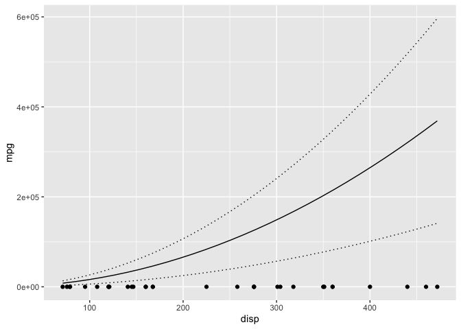

<!-- README.md is generated from README.Rmd. Please edit that file -->

# rescale 

<!-- badges: start -->

[](https://lifecycle.r-lib.org/articles/stages.html#experimental)
[](https://github.com/poissonconsulting/rescale/actions/workflows/R-CMD-check.yaml)
[](https://app.codecov.io/gh/poissonconsulting/rescale)
[](https://opensource.org/licenses/MIT)
[](https://cran.r-project.org/package=rescale)
<!-- badges: end -->

## Introduction

`rescale` is an R package to rescale columns in a data frame based on
the columns in a second data frame. For example a column can be rescaled
by subtracting the mean and dividing by the standard deviation.

The package was developed for making predictions based on models with
rescaled variables. For the predictions to be valid the new data frame
must have its predictor variables rescaled based on the original data.

The `rescale()` function simply takes a list of the columns to centre
(subtract mean) and scale (centre and then divide by standard
deviation).

The `rescale_c()` allows columns to be transformed and the values
rescaled based on rescaler codes.

The more general `rescale_f()` allows columns to be transformed and the
values to subtract and/or divide by to be defined by functions.

## Demonstration

``` r
library(ggplot2)
library(newdata)
library(rescale)
library(magrittr)

mtcars <- datasets::mtcars

data <- rescale(mtcars, scale = c("wt", "hp", "disp"))

model <- lm(mpg ~ wt + hp + poly(disp, 2), data = data)

## generate new data for plotting change in mpg with disp
new_data <- newdata::new_data(mtcars, "disp")

# without rescaling data
prediction <- predict(model, newdata = new_data, interval = "confidence") %>% cbind(new_data)

gp <- ggplot(data = prediction, aes(x = disp, y = fit)) +
  geom_point(data = mtcars, aes(y = mpg)) +
  geom_line() +
  geom_line(aes(y = lwr), linetype = "dotted") +
  geom_line(aes(y = upr), linetype = "dotted") +
  ylab("mpg")

gp
```



``` r

## scale data
scaled_data <- rescale(new_data, datasets::mtcars, scale = c("wt", "hp", "disp"))

prediction <- predict(model, newdata = scaled_data, interval = "confidence") %>%
  cbind(new_data)

gp %+% prediction
```


## Installation

To install the latest release version from CRAN.

``` r
install.packages("rescale")
```

To install the latest development version from
[r-universe](https://poissonconsulting.r-universe.dev/rescale).

``` r
install.packages("rescale", repos = c("https://poissonconsulting.r-universe.dev", "https://cloud.r-project.org"))
```

To install the latest development version from
[GitHub](https://github.com/poissonconsulting/rescale)

``` r
# install.packages("pak", repos = sprintf("https://r-lib.github.io/p/pak/stable/%s/%s/%s", .Platform$pkgType, R.Version()$os, R.Version()$arch))
pak::pak("poissonconsulting/rescale")
```

## Contribution

Please report any
[issues](https://github.com/poissonconsulting/rescale/issues).

[Pull requests](https://github.com/poissonconsulting/rescale/pulls) are
always welcome.

## Code of Conduct

Please note that the rescale project is released with a [Contributor
Code of
Conduct](https://contributor-covenant.org/version/2/0/CODE_OF_CONDUCT.html).
By contributing to this project, you agree to abide by its terms.
