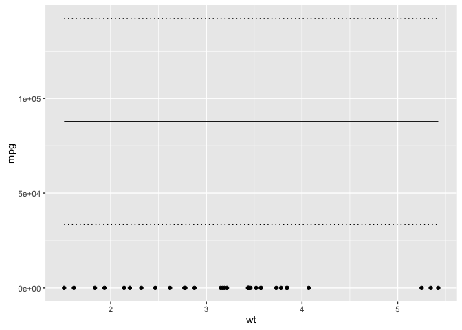
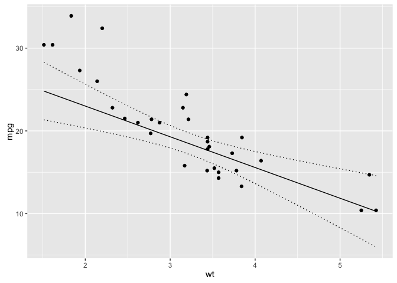
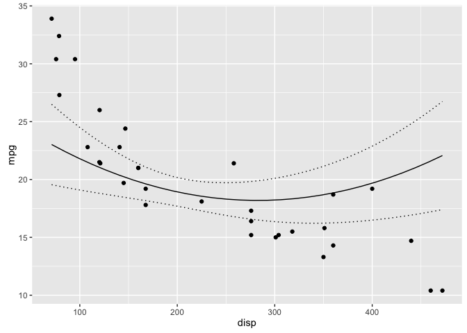

<!-- README.md is generated from README.Rmd. Please edit that file -->
[](https://travis-ci.org/poissonconsulting/rescale) [](https://ci.appveyor.com/project/poissonconsulting/rescale) [](https://codecov.io/gh/poissonconsulting/rescale)

rescale
=======

Introduction
------------

`rescale` is an R package to centers and scales columns in a data frame based on the columns in a second data frame. A column is centered by subtracting the mean and scaled (after centering) by dividing by the standard deviation.

`rescale()` was developed for making predictions based on models with centred and scaled variables. For the predictions to be valid the new data frame must have its predictor variables centered and scaled based on the original data.

Demonstration
-------------

``` r
library(ggplot2)
library(newdata)
library(rescale)

mtcars <- datasets::mtcars

model <- lm(mpg ~ wt + hp + poly(disp,2), 
            data = rescale(mtcars, scale = c("wt", "hp", "disp")))

wt <- new_data(mtcars, c("wt"))

# without rescaling data
wt2 <- cbind(wt, predict(model, newdata = wt, interval = "confidence"))

ggplot(data = wt2, aes(x = wt, y = fit)) + 
  geom_point(data = mtcars, aes(y = mpg)) + 
  geom_line() +
  geom_line(aes(y = lwr), linetype = "dotted") +
  geom_line(aes(y = upr), linetype = "dotted") +
  ylab("mpg")
```



``` r

# rescale data
wt <- cbind(wt, predict(
  model, newdata = rescale(wt, mtcars, scale = c("wt", "hp", "disp")),
  interval = "confidence"))

ggplot(data = wt, aes(x = wt, y = fit)) + 
  geom_point(data = mtcars, aes(y = mpg)) + 
  geom_line() +
  geom_line(aes(y = lwr), linetype = "dotted") +
  geom_line(aes(y = upr), linetype = "dotted") +
  ylab("mpg")
```



``` r

disp <- new_data(mtcars, c("disp"))

# rescale data
disp <- cbind(disp, predict(
  model, newdata = rescale(disp, mtcars, scale = c("wt", "hp", "disp")),
  interval = "confidence"))

ggplot(data = disp, aes(x = disp, y = fit)) + 
  geom_point(data = mtcars, aes(y = mpg)) + 
  geom_line() +
  geom_line(aes(y = lwr), linetype = "dotted") +
  geom_line(aes(y = upr), linetype = "dotted") +
  ylab("mpg")
```



Installation
------------

To install the latest version from GitHub

    # install.packages("devtools")
    devtools::install_github("poissonconsulting/rescale")

Contribution
------------

Please report any [issues](https://github.com/poissonconsulting/rescale/issues).

[Pull requests](https://github.com/poissonconsulting/rescale/pulls) are always welcome.
